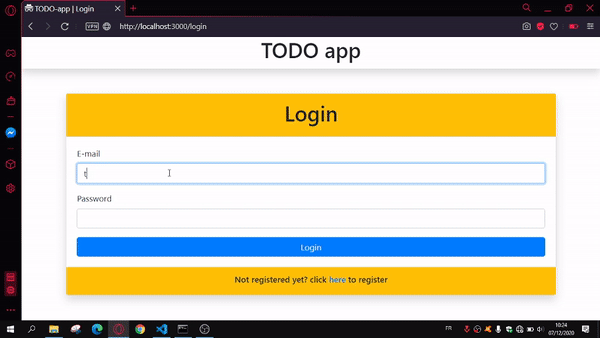

# 📘Todo-app
Just another web app. It's a simple web app that you can use to make TODOS.

# Preview

You can try the app from this [link](https://shrouded-dawn-15410.herokuapp.com/) 

# ✨Features
- User authentication
- Add new TODO
- Edit a TODO
- Delete a TODO

# 🛠Used technologies
- [Express Framework](https://www.npmjs.com/package/express) and Node.js as backend
- [Bootstrap](https://www.getbootstrap.com) for front-end
- [mongodb](https://www.mongodb.com) as database
- [passport](https://www.passportjs.org) to manage user authentication
- Vanilla JavaScript to manipulate DOM and make HTTP requests (using the built-in fetch API)

# 🏃‍♂️Running the app locally
- Node.js, git and MongoDB must be installed
- make sure mongod server is running
- create a new databes called 'todoAppDB' in mongod
- run `git clone https://github.com/islam36/todo-app.git` to clone the repo
- run `cd todo-app`
- run `npm install` to install dependencies
- run `npm start`
- open your browser and type `http://localhost:3000`

# Contributing
Any contrubution to fix bugs or adding new features is welcome!